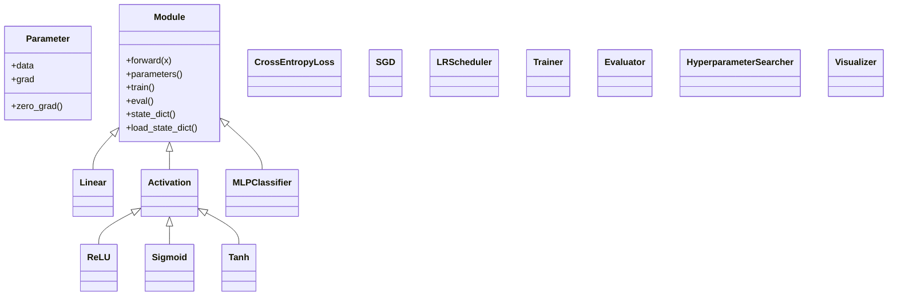

# HW1 作业解析与执行计划

![[HW1_计算机视觉.pdf]]

> [!abstract] Purpose
> 本文档不是普通笔记，而是给当前本人和未来新环境中的 Codex 使用的交接执行文档。新环境中的 Codex 在开始实现前，应先完整阅读本文件，并严格按其中的边界、交付物、写作规范、实验优先级和代码结构要求执行。

## 1. Assignment Information Extracted from the PDF

### 1.1 Task Description

- Build a three-layer neural-network classifier from scratch.
- Use the Fashion-MNIST dataset.
- Train the model for 10-class image classification.

### 1.2 Mandatory Technical Constraints

- Automatic differentiation and backpropagation must be implemented independently.
- PyTorch, TensorFlow, JAX, and any other framework with built-in autodiff support are not allowed.
- NumPy is allowed for matrix operations.

### 1.3 Mandatory Code Modules

The final codebase must contain at least the following five modules:

- Data loading and preprocessing
- Model definition
- Training loop
- Testing and evaluation
- Hyperparameter search

Good object-oriented and modular design is explicitly encouraged by the assignment.

### 1.4 Model and Optimization Requirements

- The model must allow configurable hidden dimension.
- The model must support switching between at least two activation functions, such as ReLU and Sigmoid or Tanh.
- The model must support gradient computation through backpropagation.
- The training pipeline must implement:
  - SGD
  - learning-rate decay
  - cross-entropy loss
  - L2 regularization / weight decay
- The code must automatically save the best model weights according to validation accuracy.
- Hyperparameter search must use either grid search or random search.
- At minimum, the search space must include:
  - learning rate
  - hidden dimension
  - regularization strength
- The final evaluation must:
  - load the best checkpoint
  - report test accuracy
  - print the confusion matrix

### 1.5 Submission Requirements

- A PDF report is required.
- The report must include:
  - training loss curve
  - validation loss curve
  - validation accuracy curve
- The first-layer weight matrix must be reshaped back to image size and visualized.
- The report must discuss what spatial patterns, edges, contours, or clothing structure the network has learned.
- The report must include error analysis on several misclassified test images.
- The code must be submitted in a Public GitHub repository.
- The repository `README.md` must clearly describe:
  - environment dependencies
  - how to run training
  - how to run testing
- Trained model weights should be uploaded to Google Drive or a similar external file host.
- The report must include:
  - GitHub repository link
  - model-weight download link
- The final update time of the repository and the weight link must be earlier than the deadline.

### 1.6 Other Assignment Constraints

- This is an individual assignment.
- The PDF has 2 pages.

## 2. User Hard Requirements Beyond the PDF

This section records the user's explicit hard requirements. Future Codex sessions must treat them as binding unless the user later changes them.

### 2.1 Report Language and Style

- The final report must be written in English.
- The report must avoid AI-assistant tone, Q&A tone, tutorial tone, and chat-like phrasing.
- The report must use formal paper-style writing.
- Paragraphs must be compact and information-dense.
- Explanations should be analytical, not conversational.
- Figure analysis should follow a tight pattern:
  - observation
  - explanation
  - conclusion

### 2.2 Report Quality Expectations

- The report should contain many experiments rather than the minimum number.
- The report should be as complete as possible.
- The report should contain rich visualizations.
- Better-looking and more complete results are considered beneficial for grading.
- Figures should not be treated as optional decoration; they are core deliverables.

### 2.3 Engineering Requirements

- The codebase must be highly reusable and portable.
- Different experiments should be runnable mainly by changing configuration or adding small comments, not by rewriting the pipeline.
- The project structure must be clear.
- The implementation should support extension without restructuring the whole repository.
- Future experiments should reuse the same training, evaluation, logging, and visualization framework.

### 2.5 Additional Experiment Expectations

- Activation-function support should be richer than the assignment minimum whenever practical.
- Visualization should go beyond the minimum deliverables when the implementation cost is reasonable.
- Hidden-feature visualization such as `t-SNE` is encouraged as a supplementary analysis figure.
- Comparative plots and richer evaluation artifacts are preferred over a minimal set of screenshots.

### 2.4 Handoff Requirement

- The execution-plan document must be self-contained enough that a new Codex session in a different environment can read it and immediately know what to do.

## 3. Recommended Environment

### 3.1 Python Version

- Recommended Python version: `Python 3.11`

### 3.2 Why Python 3.11

- It is modern enough for clean typing, dataclasses, `pathlib`, and current scientific Python tooling.
- It has strong compatibility with `numpy`, `matplotlib`, `pandas`, `scikit-learn`, `PyYAML`, and `tqdm`.
- It avoids some package-compatibility risks that can appear with very new versions such as `Python 3.13`.
- It is easier to reproduce on local machines, remote Linux servers, and common teaching-lab environments than older versions.

### 3.3 Suggested Dependency Baseline

- `numpy`
- `matplotlib`
- `pandas`
- `scikit-learn`
- `PyYAML`
- `tqdm`

## 4. Strict Boundary Interpretation

> [!warning] Never violate these boundaries
> Do not use any deep-learning framework with built-in autograd. Do not replace the manual implementation with framework shortcuts. Do not drift into CNN or unrelated advanced models unless the user explicitly requests that later.

### Must-Have Deliverables

- Three-layer MLP implemented from scratch
- Backpropagation implemented from scratch
- At least two switchable activation functions
- Configurable hidden dimension
- SGD
- learning-rate decay
- cross-entropy loss
- L2 regularization
- best-checkpoint saving by validation accuracy
- hyperparameter search
- test accuracy
- confusion matrix
- training loss curve
- validation loss curve
- validation accuracy curve
- first-layer weight visualization
- misclassification analysis
- public GitHub repository
- clear `README.md`
- report PDF in English
- repository link and weight-download link inside the report

### Strongly Preferred for Higher Score

- A systematic experiment matrix instead of one or two isolated runs
- Cleaner plots and better figure layout
- Better comparative analysis across hyperparameters
- More complete visual evidence
- Better repository organization and reproducibility

## 5. Primary Execution Goal

The project should be developed as a reusable experiment platform for this homework, not as a single one-off training script. The implementation should make it easy to add new experiments through configuration, rerun evaluation, regenerate figures, and write the report with minimal duplicated work.

## 6. Implementation Roadmap

### Phase 1: Minimal End-to-End Baseline

Implement the smallest complete training pipeline that can produce one valid baseline result.

Required components:

- dataset download / loading
- preprocessing and train / validation split
- parameter and module abstractions
- linear layer
- activation layer
- stable softmax cross-entropy
- three-layer MLP forward pass
- manual backward pass
- SGD optimizer
- learning-rate scheduler
- training loop
- validation loop
- checkpoint saving

Success criterion:

- one baseline run completes
- best validation checkpoint is saved
- test evaluation can be executed with that checkpoint

### Phase 2: Turn the Baseline into a Reusable Experiment Framework

Refactor the implementation so that experiments are configuration-driven.

Requirements:

- hyperparameters must live in config files
- `train.py` should only orchestrate training from config
- `search.py` should only orchestrate search jobs and result aggregation
- `evaluate.py` should load checkpoints and report metrics
- `visualize.py` should regenerate figures from stored logs and predictions
- outputs must be stored under `artifacts/`

Success criterion:

- adding a new experiment should require changing config, not rewriting the training pipeline

### Phase 3: High-Value Experiment Matrix

The assignment does not cap experiment count. Therefore, the report should use a staged experiment plan.

#### Baseline Group

- `hidden_dim=128`
- `activation=relu`
- medium learning rate
- medium weight decay

#### Activation Comparison

- ReLU
- Sigmoid
- Tanh

#### Hidden-Dimension Comparison

- 64
- 128
- 256
- 512

#### Learning-Rate Comparison

- high
- medium
- low

Suggested initial values:

- `0.1`
- `0.05`
- `0.01`

#### Weight-Decay Comparison

- `0`
- `1e-4`
- `5e-4`
- `1e-3`

#### Learning-Rate-Decay Comparison

- no decay
- step decay
- exponential decay

### Phase 4: Reporting Asset Generation

The codebase must automatically or semi-automatically generate report-ready assets.

Required assets:

- train-loss curve
- validation-loss curve
- validation-accuracy curve
- confusion-matrix figure
- first-layer weight-visualization figure
- error-case figure
- hyperparameter comparison table

Preferred additional assets:

- representative dataset samples
- per-class accuracy table
- class-pair confusion summary
- multiple first-layer filters shown in a grid
- hidden-feature `t-SNE` scatter plot

## 7. Object-Oriented Design Requirements

The architecture must support reuse and migration. Future Codex sessions should preserve this structure unless there is a compelling reason to change it.



### Responsibility Split

- `Parameter`
  - stores value and gradient
- `Module`
  - base class for parameter collection and model state IO
- `Linear`
  - affine transform and backward logic
- `Activation`
  - switchable nonlinearities
- `CrossEntropyLoss`
  - stable softmax and gradient w.r.t. logits
- `SGD`
  - parameter update with weight decay
- `LRScheduler`
  - learning-rate decay policy
- `Trainer`
  - epoch loop, batching, validation, checkpointing, logging
- `Evaluator`
  - test metrics, confusion matrix, prediction dump, error collection
- `HyperparameterSearcher`
  - grid search or random search orchestration
- `Visualizer`
  - figure generation for curves, confusion matrix, weights, and misclassified examples

## 8. Repository Design

### Required Layout

```text
CV/
├── HW1_计算机视觉.pdf
├── HW1_作业解析与执行计划.md
├── README.md
├── requirements.txt
├── configs/
│   ├── baseline.yaml
│   ├── search_grid.yaml
│   └── experiments.md
├── scripts/
│   ├── train.py
│   ├── search.py
│   ├── evaluate.py
│   └── visualize.py
├── src/cvhw1/
│   ├── core/
│   ├── data/
│   ├── models/
│   ├── nn/
│   ├── optim/
│   ├── training/
│   ├── evaluation/
│   ├── search/
│   └── utils/
├── reports/
│   └── report_outline.md
├── artifacts/
└── notes/
    └── report_assets_checklist.md
```

### Repository Principles

- Configuration-driven experiments
- Clear separation between training, search, evaluation, and visualization
- Centralized artifact storage
- Minimal duplication
- Easy migration to similar classification assignments

## 9. English Report Requirements

The final report must be written in English and must read like a compact course-project paper.

### Style Constraints

- use formal academic English
- avoid AI-assistant voice
- avoid Q&A style
- avoid tutorial voice
- avoid conversational fillers
- keep paragraphs tight
- avoid redundant transitions such as:
  - "next, we will"
  - "as we can see"
  - "in the following"

### Required Report Sections

- Title
- Abstract
- Introduction
- Task Requirements and Experimental Goals
- Dataset and Preprocessing
- Model Design and From-Scratch Implementation
- Experimental Setup
- Results and Analysis
- First-Layer Weight Visualization
- Error Analysis
- Conclusion
- Repository and Weight Links

### Required Figures and Tables

- training / validation loss figure
- validation accuracy figure
- confusion matrix
- first-layer weight visualization
- error-case figure
- hidden-feature `t-SNE` figure
- hyperparameter-results table

## 10. Writing Strategy for the Final Report

The report should not be written after all experiments in a rush. Instead, its structure should be prepared early, and each experiment should produce reusable material for direct insertion into the paper.

### Practical Writing Rules

- write analytical paragraphs, not bullet-heavy notes
- each paragraph should serve one clear purpose
- state findings directly
- connect claims to figures or tables
- discuss only meaningful experimental differences
- do not pad the report with generic neural-network background

## 11. Handoff Instructions for a Future Codex Session

If a future Codex session continues this project in another environment, it should do the following in order:

1. Read this file completely.
2. Read `README.md`, `configs/baseline.yaml`, and `configs/search_grid.yaml`.
3. Confirm that the implementation still respects the no-framework boundary.
4. Implement the core NumPy-based training stack first.
5. Produce one baseline run before broad hyperparameter search.
6. Add reproducible logging and artifact saving.
7. Generate report-ready figures automatically.
8. Fill the English report with real results and replace placeholders.
9. Keep the code modular; do not collapse everything into one script.
10. Preserve portability so that future experiments only require config changes.

> [!important] Non-negotiable execution priority
> Correctness first, reusability second, breadth of experiments third, report polish fourth. However, the code must still be designed from the beginning to support rich visualizations and multiple experiments without rewrites.

## 12. Current Project Status

Already completed:

- assignment requirements extracted
- repository skeleton created
- local git repository initialized
- baseline config drafted
- search config drafted
- report template created

Not completed yet:

- actual NumPy implementation
- data pipeline
- training pipeline
- hyperparameter search
- figure generation
- final English report with real experimental results

## 13. Immediate Next Step

The next correct step is to implement the full NumPy-based core training stack and get a baseline run working end to end.
